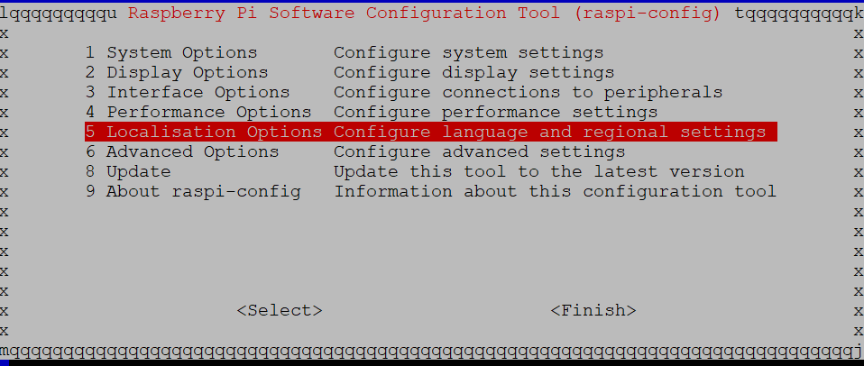
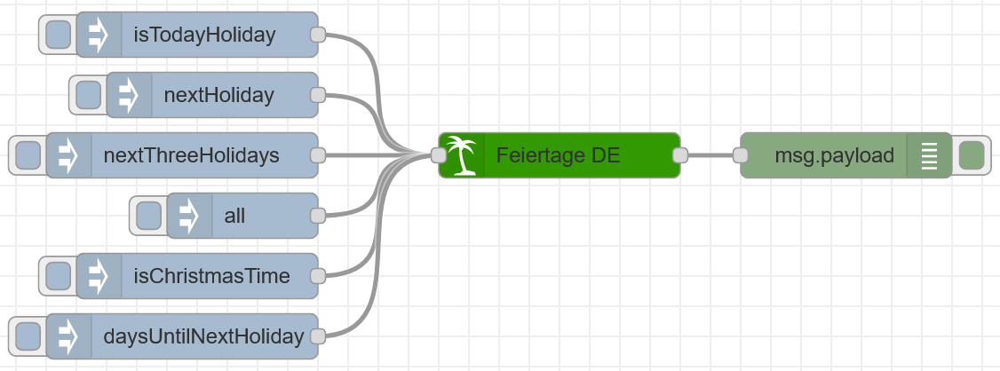

# Node Red Feiertage Germany

[](https://www.npmjs.com/package/node-red-contrib-feiertage-germany)
[](https://www.npmjs.com/package/node-red-contrib-feiertage-germany)
[](https://github.com/MariusLang/node-red-contrib-germany/issues)

[](https://nodei.co/npm/node-red-contrib-feiertage-germany/)

The Node Red **Feiertage Germany** node is the ultimative node to get informations about german holidays.

Is there any holiday missing? Write an issue! I'm going to add this holiday for you.

This node was splitted out of the [node-red-contrib-feiertage](https://github.com/MariusLang/node-red-contrib-feiertage) node. This Node only contains **German** holidays.
To get this node for an other country read the point below.

## You're living in Germany, Austria or Switzerland?

country | node-red node
--- | ---
Germany | [node-red-contrib-feiertage-germany](https://github.com/MariusLang/node-red-contrib-feiertage)
Austria | [node-red-contrib-feiertage-austria](https://github.com/MariusLang/node-red-contrib-feiertage-austria)
Switzerland | *coming soon*
Or you want all in one node (Germany, Austria, Switzerland) | [node-red-contrib-feiertage](https://github.com/MariusLang/node-red-contrib-feiertage)

## Installation
```
npm install node-red-contrib-feiertage-germany
```

## Getting Started
At first, it's important to check that you have picked the rigth localisation and timezone on your device. Below you can find a manual how to change those settings on to a RaspberryPi.

Login into your Pi. Then open the settings with this command.

```
sudo raspi-config
```

Now you should see this interface. Navigate to **5 Localisation Options** and press ENTER.



Here you can set your **Local** and **Timezone**.
If your localisation is Germany chose **de_DE.UTF-8** as your local and **Europe** --> **Berlin** as your timezone.


After you have finished setup click **Finish**.
To  make your changes valid reboot your pi.

```
sudo reboot
```

## Node Description

### Input
The input can be used to trigger special outputs. The keywords are listed below.

msg.payload | output
--- | ---
isTodayHoliday | boolean wether today is holiday
isChristmasTime | boolean wether today is Christmas time (1. Advent - Heilige drei Könige)
nextHoliday | information about next holiday
nextThreeHolidays | informations about next 3 holidays
all | informations about all holidays

### Output
The output can be used to listen to automatic and user triggered events. Every day at 00:01 o'clock the node automaticly outputs a boolean value wether today is a holiday.

You decide what you want to receive: Object or Array!
To enable output as array open the node settings and hit the checkbox **output: Array instead of Object** at the bottom.

holiday object output:

key | output
--- | ---
id | id
name | name
dateObj | date (yyyy-mm-dd)
dateDE | german date (dd.mm.yyyy)

holiday array[3] output:

index | output
--- | ---
0 | id
1 | name
2 | date (yyyy-mm-dd)
3 | german date (dd.mm.yyyy)

### Own Holidays
You can chose up to 10 own dates. Select the **day** in the first dropdown-menu and the **month** in the second. Chose a name for your holiday and type it into the input field. Don't forget to hit the checkbox to enable your own holiday. Pay attention: The node does NOT validate your own dates. So if you set the 30 febrary or the 31 april as date you wont't get an error message.


## Example Flow
You can import this example into your Node Red flow.



```
[{"id":"b9fb77e7.cd4f2","type":"inject","z":"f250d57e.bf23e8","name":"","props":[{"p":"payload"}],"repeat":"","crontab":"","once":false,"onceDelay":0.1,"topic":"","payload":"nextHoliday","payloadType":"str","x":390,"y":1040,"wires":[["48b77111.526bd8"]]},{"id":"9d602aef.57695","type":"debug","z":"f250d57e.bf23e8","name":"","active":true,"tosidebar":true,"console":false,"tostatus":false,"complete":"false","statusVal":"","statusType":"auto","x":810,"y":1080,"wires":[]},{"id":"f1ab8b1e.4acee","type":"inject","z":"f250d57e.bf23e8","name":"","props":[{"p":"payload"}],"repeat":"","crontab":"","once":false,"onceDelay":0.1,"topic":"","payload":"isTodayHoliday","payloadType":"str","x":380,"y":1000,"wires":[["48b77111.526bd8"]]},{"id":"b72360ac.69acf","type":"inject","z":"f250d57e.bf23e8","name":"","props":[{"p":"payload"}],"repeat":"","crontab":"","once":false,"onceDelay":0.1,"topic":"","payload":"nextThreeHolidays","payloadType":"str","x":370,"y":1080,"wires":[["48b77111.526bd8"]]},{"id":"3892a3a5.2a994c","type":"inject","z":"f250d57e.bf23e8","name":"","props":[{"p":"payload"}],"repeat":"","crontab":"","once":false,"onceDelay":0.1,"topic":"","payload":"all","payloadType":"str","x":410,"y":1120,"wires":[["48b77111.526bd8"]]},{"id":"9be20d09.0f97a8","type":"inject","z":"f250d57e.bf23e8","name":"","props":[{"p":"payload"}],"repeat":"","crontab":"","once":false,"onceDelay":0.1,"topic":"","payload":"isChristmasTime","payloadType":"str","x":380,"y":1160,"wires":[["48b77111.526bd8"]]},{"id":"1439253f.99c7cb","type":"inject","z":"f250d57e.bf23e8","name":"","props":[{"p":"payload"}],"repeat":"","crontab":"","once":false,"onceDelay":0.1,"topic":"","payload":"daysUntilNextHoliday","payloadType":"str","x":370,"y":1200,"wires":[["48b77111.526bd8"]]},{"id":"48b77111.526bd8","type":"feiertageDE","z":"f250d57e.bf23e8","name":"Feiertage DE","local":"DE","neujahr":true,"neujahrName":"Neujahr","heiligeDreiKoenige":true,"heiligeDreiKoenigeName":"Heilige drei Könige","weiberfastnacht":true,"weiberfastnachtName":"Weiberfastnacht","valentinstag":true,"valentinstagName":"Valentinstag","rosenmontag":true,"rosenmontagName":"Rosenmontag","fastnachtsdienstag":true,"fastnachtsdienstagName":"Fastnachtdienstag","aschermittwoch":true,"aschermittwochName":"Aschermittwoch","gruendonnerstag":true,"gruendonnerstagName":"Gründonnerstag","karfreitag":true,"karfreitagName":"Karfreitag","easterSunday":true,"easterSundayName":"Ostersonntag","easterMonday":true,"easterMondayName":"Ostermontag","firstMay":true,"firstMayName":"1. Mai","christiHimmelfahrt":true,"christiHimmelfahrtName":"Christi Himmelfahrt","pfingstsonntag":true,"pfingstsonntagName":"Pfingstsonntag","pfingstmontag":true,"pfingstmontagName":"Pfingstmontag","fronleichnam":true,"fronleichnamName":"Fronleichnam","mariaHimmelfahrt":true,"mariaHimmelfahrtName":"Maria Himmelfahrt","tagDerDeutschenEinheit":true,"tagDerDeutschenEinheitName":"Tag der Deutschen Einheit","halloween":true,"halloweenName":"Halloween","allerheiligen":true,"allerheiligenName":"Allerheiligen","stMartin":true,"stMartinName":"St. Martin","bussUndBettag":true,"bussUndBettagName":"Buß und Bettag","nikolaus":true,"nikolausName":"Nikolaus","advent1":true,"advent1Name":"1. Advent","advent2":true,"advent2Name":"2. Advent","advent3":true,"advent3Name":"3. Advent","advent4":true,"advent4Name":"4. Advent","heiligabend":true,"heiligabendName":"Heiligabend","weihnachten1":true,"weihnachten1Name":"1. Weihnachtsfeiertag","weihnachten2":true,"weihnachten2Name":"2. Weihnachtsfeiertag","silvester":true,"silvesterName":"Silvester","ownHoliday1":false,"ownHoliday1Day":1,"ownHoliday1Month":1,"ownHoliday1Name":"own Date 1","ownHoliday2":false,"ownHoliday2Day":2,"ownHoliday2Month":2,"ownHoliday2Name":"own Date 2","ownHoliday3":false,"ownHoliday3Day":3,"ownHoliday3Month":3,"ownHoliday3Name":"own Date 3","ownHoliday4":false,"ownHoliday4Day":4,"ownHoliday4Month":4,"ownHoliday4Name":"own Date 4","ownHoliday5":false,"ownHoliday5Day":5,"ownHoliday5Month":5,"ownHoliday5Name":"own Date 5","ownHoliday6":false,"ownHoliday6Day":6,"ownHoliday6Month":6,"ownHoliday6Name":"own Date 6","ownHoliday7":false,"ownHoliday7Day":7,"ownHoliday7Month":7,"ownHoliday7Name":"own Date 7","ownHoliday8":false,"ownHoliday8Day":8,"ownHoliday8Month":8,"ownHoliday8Name":"own Date 8","ownHoliday9":false,"ownHoliday9Day":9,"ownHoliday9Month":9,"ownHoliday9Name":"own Date 9","ownHoliday10":false,"ownHoliday10Day":10,"ownHoliday10Month":10,"ownHoliday10Name":"own Date 10","x":620,"y":1080,"wires":[["9d602aef.57695"]]}]
```